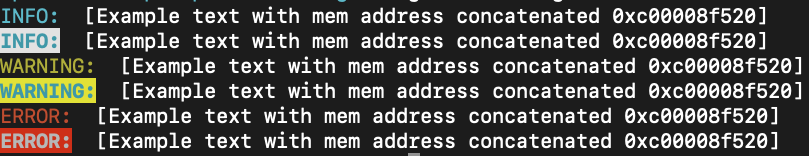

# terminal-app-log

When we want to print information to a user in a terminal app context we do not want to print ugly log messages, so this package is intended to 
be an easy way to print text in a terminal UI different types of levels of text(INFO, WARNING, ERROR, NORMAL) using just 'fmt' package.

Supports linux, macOs, Windows





## Install package

```sh
go get github.com/Alana-Research/terminal-app-log
```

## How to use

```
...
import "tlog "github.com/Alana-Research/terminal-app-log""
...

tlog.Warn(fmt.Sprintf("Example text with mem address concatenated %p", &x))
tlog.BigWarn(fmt.Sprintf("Example text with mem address concatenated %p", &x))
...

```

## Credits

 * [Fatih Arslan - color package](https://github.com/fatih/color)

## License

The MIT License (MIT) - see [`LICENSE.md`](https://github.com/Alana-Research/terminal-app-log/blob/master/LICENSE.md) for more details

